# Driver Shift Diary («Дневник смен»)

A shift diary for ride-hailing drivers. The driver logs each trip (time, fare, park commission, cash or card) and sees the day's payout at a glance: **«На руки»** (net), revenue, commission, trip count and the cash/card split.

The repo holds three parts:

- **Flutter app** (`apps/mobile`): Riverpod with clean architecture.
- **Design kit** (`packages/design_kit`): tokens, themes and components, plus a showcase app.
- **FastAPI backend** (`backend`): PostgreSQL, deployed on Railway.

**Deployed API:** https://api-production-6e8b.up.railway.app
- Swagger UI: [`/docs`](https://api-production-6e8b.up.railway.app/docs)
- Example: [`/summary?date=2026-10-01`](https://api-production-6e8b.up.railway.app/summary?date=2026-10-01)

---

## Screenshots

All images are rendered by the app's own tests at 390×844 @2x with the real fonts (see [Screenshots and goldens](#screenshots-and-goldens)).

**Day screen**

| Day | Dark theme | Trip just added | No trips | Loading | Load error |
|---|---|---|---|---|---|
| 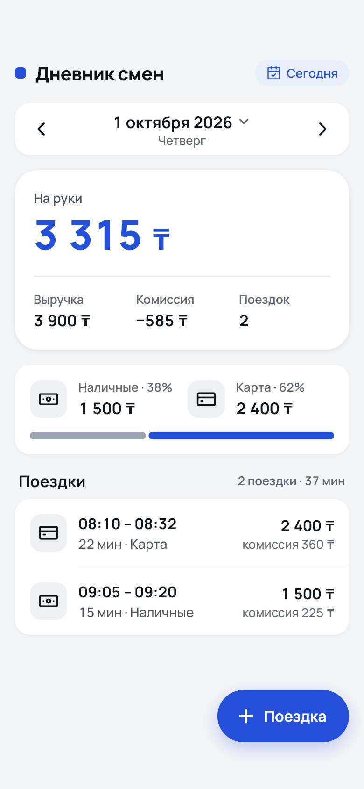 | 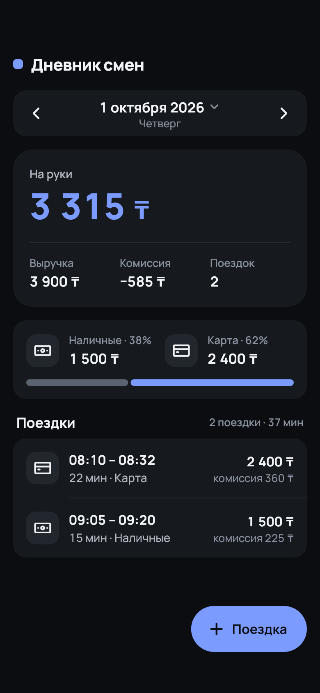 | 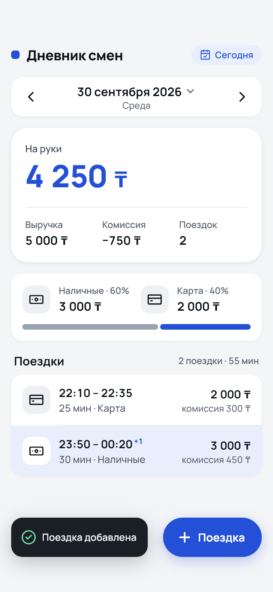 | 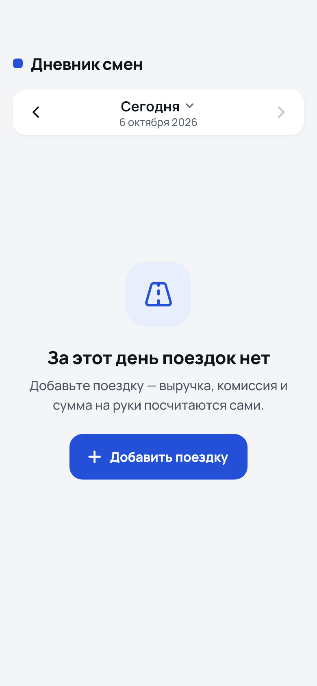 | 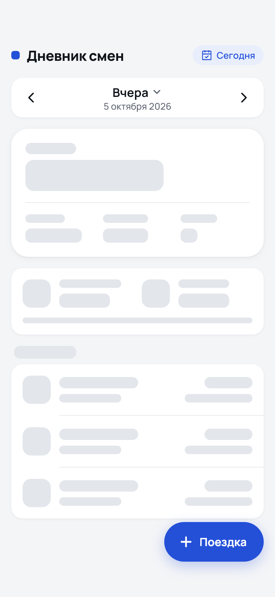 | 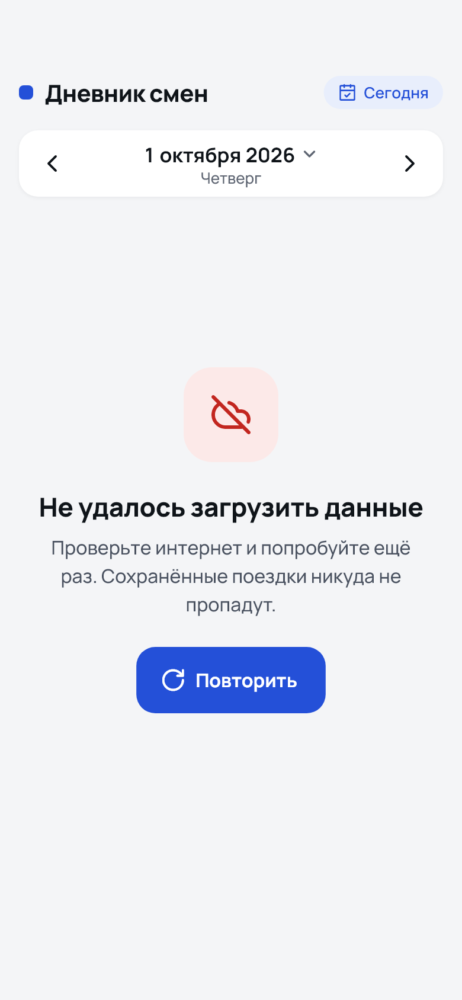 |

**Adding a trip**

| Form | Validation | Past midnight | Offline, resending | 409 conflict | Close unsaved |
|---|---|---|---|---|---|
| 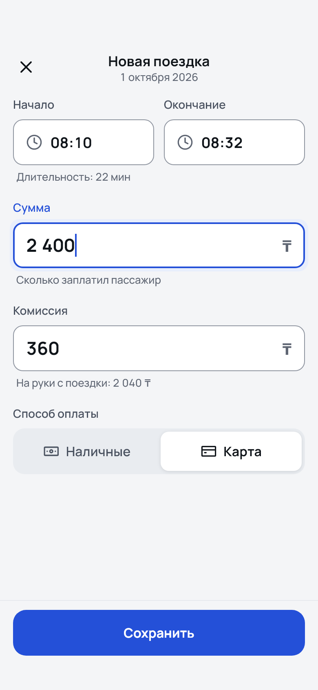 | 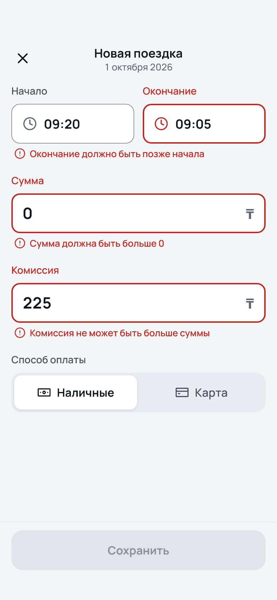 | 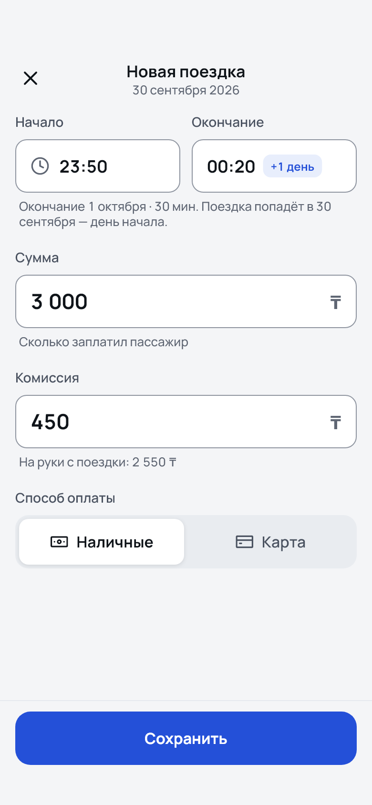 | 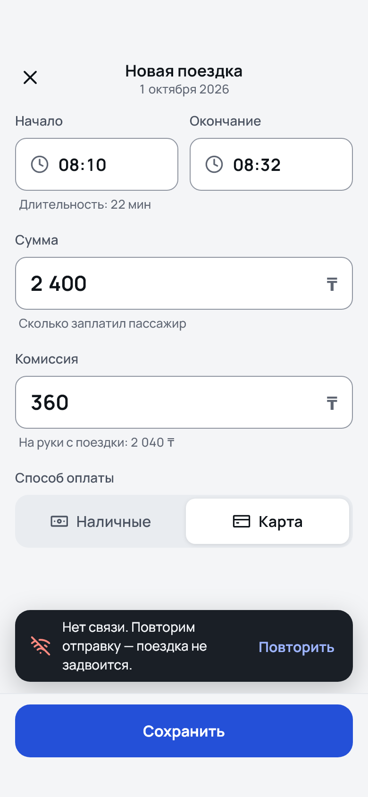 | 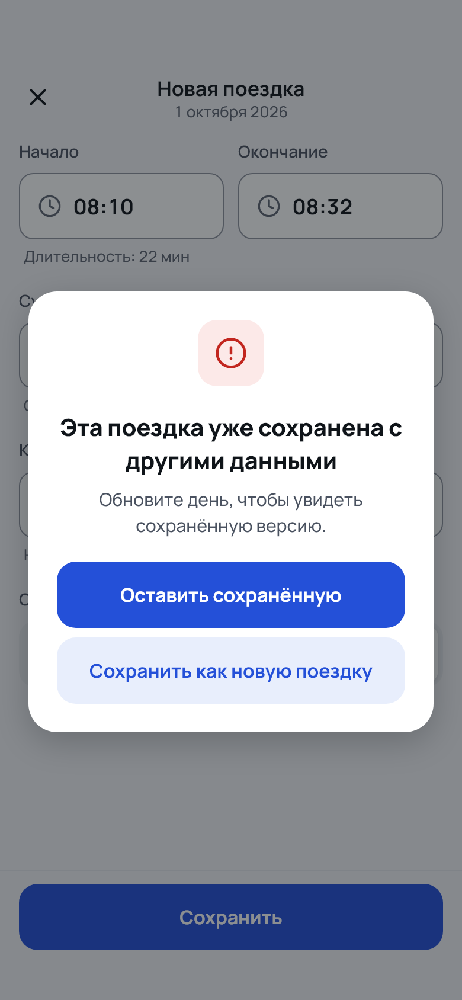 | 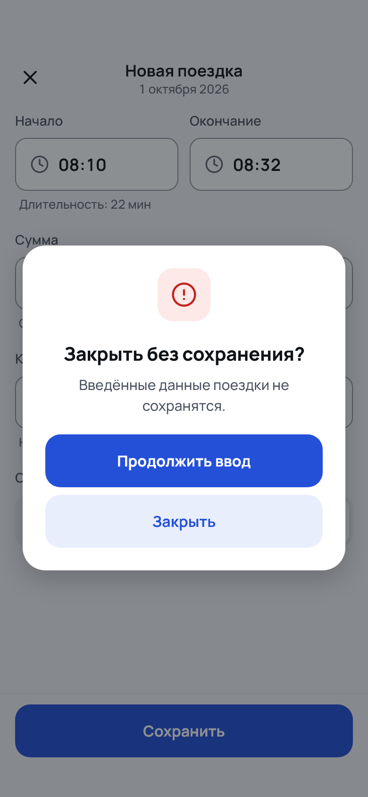 |

**Pickers** (iOS-style wheel on Android and iOS)

| Date | Time |
|---|---|
| 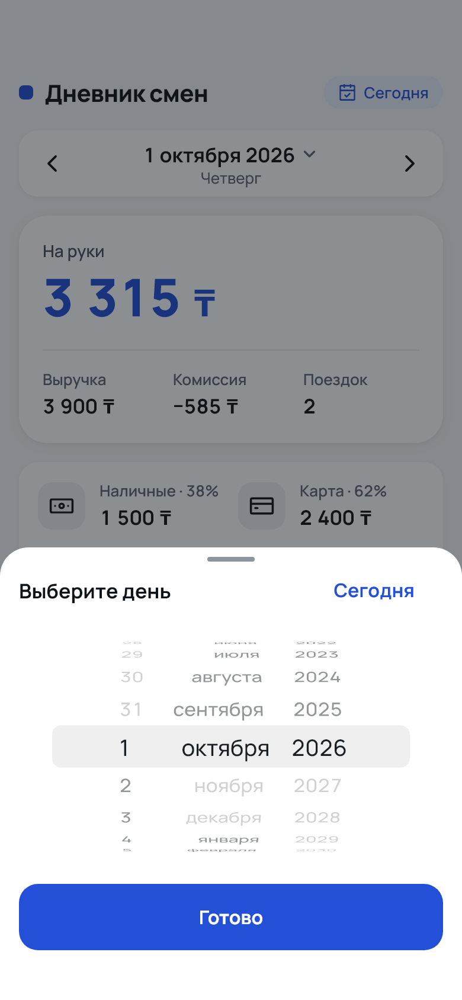 | 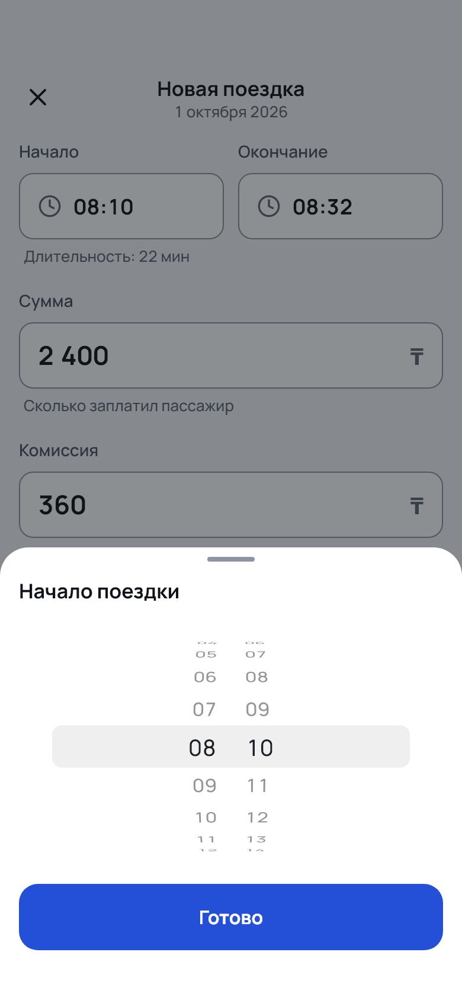 |

---

## What the app does

### Day screen
- **Header:** «Дневник смен», plus a **«Сегодня»** pill on the right whenever another day is shown. One tap returns to today.
- **Day switcher:** ‹ › step one day back or forward (never past today). Tapping the date opens a wheel date picker with a «Сегодня» shortcut. Titles read «Сегодня», «Вчера», or the date with the weekday.
- **Summary card:** «На руки» (revenue − commission) as the hero number, then revenue, commission and trip count.
- **Payment card:** cash and card totals with their shares («Наличные · 38%») and a split bar.
- **Trip list:** time range («+1» if the trip ends after midnight), duration and payment method, amount, and commission.
- **States:** a skeleton while loading, an empty state with «Добавить поездку», and an error state with «Повторить». Pull to refresh works in every state. A failed refresh keeps the data on screen and shows a snackbar with «Повторить».
- **Fast day switching:** every day you open stays cached for 5 minutes, and the day before and after the current one load in the background. Going back to a day you just saw shows it instantly, with no skeleton.

### Add trip
- **Full-screen form** for the day selected on the Day screen. The date appears under the title; to log a trip for another day, switch the day first.
- **Fields:** start and end time (wheel pickers, 24 h), fare, commission (the helper shows the net), and payment method (cash or card).
- **Past midnight:** an end time at or before the start means the trip ended the next day. The form shows «+1 день» and explains it. The trip belongs to its start day; the form allows at most 12 h.
- **Validation:** every field is checked locally with the same rules and error codes as the server. Errors show once a field has been left, or after Save. A server 422 appears under the field it names.
- **Idempotent saving:** the trip id is the idempotency key.
  - If the connection drops, or the server answers 5xx or times out, the snackbar «Нет связи. Повторим отправку — поездка не задвоится.» appears.
  - The form then resends **the same trip with the same id** after 2, 4 and 8 s, then every 30 s; «Повторить» resends at once.
  - Editing the form stops the resends; the next Save gets a new id.
  - A 409 (the same id already saved with different data) opens a conflict dialog.
- **Closing with unsaved input** (✕ or system back) asks «Закрыть без сохранения?» in a centred dialog.
- **Save** stays pinned right above the keyboard.

### Look and feel
- **Theme:** the app opens in the **light** theme whatever the phone setting. The dark theme exists in the kit and is covered by tests and goldens.
- **Money:** integer tenge, formatted as `3 315 ₸` (narrow no-break space U+202F, real minus `−585 ₸`). Figures are tabular.
- **Accessibility:**
  - Every tap target is ≥ 48 dp and has a spoken label («Предыдущий день», «Выбрать дату, 1 октября 2026», «Наличные 38%, карта 62%», …).
  - Text contrast passes WCAG AA in both themes.
  - Layouts are tested at 360 and 390 dp with text scale 1.0 and 1.3.

---

## Recent changes (post-redesign fixes)

| Change | Why |
|---|---|
| iOS-style wheel pickers (`DkPickerSheet`) for the date and times, on every platform | The Material Android date/time dialogs were awkward to use |
| Per-day cache (5 min) + background loading of the neighbouring days | Going back to a day you just saw showed the skeleton again |
| «Сегодня» button in the header | Getting back to today took several taps on › |
| Payment label «Наличные · 17%» and trip meta «30 мин · Наличные» stay on one line | They wrapped onto a second line at 360 dp |
| Dialogs are centred (icon, title, message), max width 400 | The left-aligned discard dialog looked unbalanced |
| The app always opens in the light theme | It followed the phone's dark setting |

The full history of decisions is in [`docs/DECISIONS.md`](docs/DECISIONS.md), and the AI's mistakes and how they were caught are in [`docs/AI_NOTES.md`](docs/AI_NOTES.md).

---

## Repository layout

```
apps/mobile/            Flutter app (Riverpod 3, clean architecture: domain / data / presentation)
packages/design_kit/    Design tokens, light + dark themes, Dk* components, formatting; example/ showcase
backend/                FastAPI service (domain / application / api / infrastructure), Alembic, Dockerfile
data/trips.json         Demo/seed data (131 trips, 2026-09-21 .. 10-06, with edge cases)
docs/                   DECISIONS.md, AI_NOTES.md, DESIGN_AUDIT.md, design/ (mockups + audits), screenshots/
DESIGN.md               Visual spec: tokens, components, screens, copy, acceptance checklist (copy in the kit)
tool/                   update_ci_goldens.sh (Linux goldens in Docker)
docker-compose.yml      Local Postgres (+ optional full stack)
railway.json            Railway build/deploy config
.github/workflows/ci.yml  CI: backend, design kit, mobile app
```

---

## Architecture

### Backend (`backend/`)
- **Domain:** frozen dataclasses (`Trip`, `DayWindow`, `DailySummary`) validate themselves, so an invalid trip cannot exist. A day is `[00:00, next 00:00)` in the driver's UTC offset, and a trip belongs to the day of its start.
- **Application:** use cases depend on a repository port.
- **Infrastructure:** SQLAlchemy async with asyncpg, Postgres. Every domain rule is repeated as a DB `CHECK`. Day queries use a UTC half-open interval on an indexed `TIMESTAMPTZ` column.
- **Idempotency:** `INSERT … ON CONFLICT (id) DO NOTHING`, then the stored trip is read back and compared. The primary key decides atomically, with no check-then-insert.
- **Errors:** every error uses one shape, `{"error": {"code", "message", "field"}}`. Codes are stable; the client shows its own Russian text for each code.

### Mobile app (`apps/mobile/`)
- **`domain/`:** entities, trip rules shared with the form, and `calculateDailySummary`. The card and the list are computed from the same trips, so they can never disagree.
- **`data/`:** dio client, DTOs (freezed/json_serializable), and a repository returning `Result<T>` (`Ok`/`Err` with a sealed `Failure`).
- **`presentation/`:** Riverpod providers (`dayTripsProvider(day)`, `daySummaryProvider(day)`, `selectedDayProvider`, `addTripController`) and the screens.
- **Time:** the driver's zone is explicit (`DriverZone`, `--dart-define=DRIVER_TZ`, default `+05:00`), never the phone's zone.

### Design kit (`packages/design_kit/`)
- **The only source of styling:** colours, type, spacing, radii, shadows, icons and formatting live here. The app reads tokens through `context.dkColors`, `context.dkText`, `context.dkSpacing`, … and builds its screens only from `Dk*` components. CI fails on `Color(0x`, `Colors.` or `TextStyle(` in `apps/mobile/lib`.
- **Tokens:** `DkColors`, `DkTypography`, `DkSpacing`, `DkRadii`, `DkElevation`, `DkSizes` and `DkMotion`, with light and dark themes in `DkTheme`. `spec_conformance_test.dart` parses `DESIGN.md` and checks every value.
- **Fonts:** Manrope 500–800, with IBM Plex Sans as the fallback for `₸` and U+202F. Icons are Lucide.
- **Components:**
  - buttons and FAB, cards, summary and payment cards, trip tile and list;
  - day switcher, «Сегодня» button, text, money and time fields, badge, segmented control;
  - **picker sheet** (date/time wheel), snackbars, dialog;
  - empty, error and skeleton states, modal app bar, bottom bar.
- **Formatting:** `DkMoney` and `DkFormat` (Russian dates, relative days, durations, plurals, split percentages).

---

## API

| Method | Path | Description |
|---|---|---|
| GET | `/health` | `{"status":"ok","database":"ok"}`; 503 if the DB is unreachable (used as the Railway healthcheck) |
| GET | `/trips?date=YYYY-MM-DD&tz=+05:00` | Trips that start on that local day, ordered by start: `{date, tz, trips:[…]}` |
| GET | `/summary?date=YYYY-MM-DD&tz=+05:00` | Day totals: trips, revenue, commission, net, cash, card |
| POST | `/trips` | Create a trip: 201 new, 200 same id and same payload (returns the stored trip), 409 same id with different data, 422 validation |

The trip body:

```json
{"id": "t1", "start": "2026-10-01T08:10:00+05:00", "end": "2026-10-01T08:32:00+05:00",
 "amount": 2400, "payment": "card", "commission": 360}
```

**Validation rules:**
- `id`: 1–64 chars of `[A-Za-z0-9_-]` (the app sends UUID v4).
- Money: integers only, `0 < amount ≤ 10 000 000`, `0 ≤ commission ≤ amount`.
- Times: timestamps carry an offset; `end > start`; a trip lasts at most 24 h on the server (12 h in the app's form).
- Dates: 2000–2099.

**Reference case:** 2026-10-01 has 2 trips → revenue 3 900, commission 585, net 3 315; cash 1 500, card 2 400.

---

## Running locally

### Prerequisites
- Flutter 3.47.6 (Dart 3.13)
- Python 3.12 with [uv](https://docs.astral.sh/uv/)
- Docker (for Postgres)

### Backend
```bash
docker compose up -d db                 # Postgres 16 on localhost:5433 (+ driver_diary_test DB)
cd backend
uv sync
uv run alembic upgrade head             # create the schema
uv run python -m app                    # http://127.0.0.1:8000/docs (seeds data/trips.json into an empty DB)
```
Or run the whole stack in Docker: `docker compose --profile full up --build` → http://localhost:8000/docs.

**Config (env, via pydantic-settings):**

| Variable | Meaning |
|---|---|
| `DATABASE_URL` | `postgres://` / `postgresql://` is converted to `postgresql+asyncpg://` |
| `PORT` | Port uvicorn listens on |
| `SEED_ON_STARTUP` | Seed an empty DB on startup (default `true`) |
| `SEED_FILE` | Path of the seed file |
| `CORS_ORIGINS` | JSON list, default `["*"]` |

**Demo data:** to regenerate it, or to load it into an already running API (idempotent, through `POST /trips`):
```bash
uv run python scripts/generate_demo_trips.py
uv run python scripts/load_trips.py https://api-production-6e8b.up.railway.app
```

### Mobile app
```bash
flutter pub get                                          # from the repo root (pub workspace)
cd apps/mobile
flutter run                                              # uses the deployed API
flutter run --dart-define=API_URL=http://10.0.2.2:8000   # Android emulator -> local backend
flutter run -d chrome                                    # web build
dart run build_runner build                              # after changing DTOs or providers
```
Config: `--dart-define=API_URL=…` (default: the Railway URL) and `--dart-define=DRIVER_TZ=+05:00`.

### Design kit showcase
```bash
cd packages/design_kit/example
flutter run -d chrome          # web: append ?theme=dark and/or ?tab=tokens to the URL
```

---

## Tests and CI

```bash
# Flutter (from the repo root)
flutter analyze
(cd packages/design_kit && flutter test)
(cd packages/design_kit/example && flutter test)
(cd apps/mobile && flutter test)
LIVE_API_URL=http://127.0.0.1:8000 flutter test apps/mobile/test/live   # contract tests vs a running backend

# Backend
cd backend
uv run ruff format --check . && uv run ruff check . && uv run mypy
uv run pytest                       # Windows: uv run python -m pytest; integration tests need Postgres
```

| Suite | What it covers |
|---|---|
| Backend (114 unit + 80 integration) | Domain rules, day boundaries (with hypothesis property tests), API shapes, idempotency 201/200/409 including concurrent inserts, migrations up/down. Coverage ≥ 95% is enforced in CI. |
| Design kit (170) | Every component and state, token values against `DESIGN.md`, money formatting and input, goldens, accessibility |
| Mobile app (~200) | Domain, DTOs, providers (including the day cache), form behaviour, retries and idempotency, screens, accessibility in both themes, a layout matrix at 360/390 dp × text 1.0/1.3 that fails on any overflow or truncated text, Day goldens |

CI (`.github/workflows/ci.yml`) runs three jobs on every push:

- **Backend:** ruff, mypy, pytest against a real Postgres service.
- **Design kit:** analyze, format, tests, showcase tests.
- **Mobile app:** generated code up to date, the no-raw-styles check, analyze with `--fatal-infos`, format, tests.

### Screenshots and goldens

Golden tests use [alchemist](https://pub.dev/packages/alchemist):

| | Where | Text | Compared |
|---|---|---|---|
| Platform goldens | `test/goldens/<os>/` (e.g. `windows/`) | real fonts, for review | locally only (when `CI` is not set) |
| CI goldens | `test/goldens/ci/` (app: `test/screens/goldens/ci/`) | drawn as blocks | only on CI |

```bash
# After an intended visual change: this OS's real-font goldens
(cd packages/design_kit && flutter test --update-goldens)
(cd apps/mobile && flutter test --update-goldens test/screens/day_golden_test.dart)

# CI goldens: generated on Linux in Docker (font metrics differ between OSes)
tool/update_ci_goldens.sh packages/design_kit apps/mobile

# README / audit screenshots (390×844 @2x, real fonts)
cd apps/mobile && SCREENSHOTS_DIR=build/screens flutter test test/screens/screenshots_test.dart
```

---

## Deploy to Railway

The image is built from the repo root with `backend/Dockerfile`, with `/health` as the healthcheck. The container runs `alembic upgrade head` and then uvicorn on `$PORT`.

```bash
railway login
railway init --name driver-shift-diary
railway add --database postgres
railway add --service api
railway variable set 'DATABASE_URL=${{Postgres.DATABASE_URL}}' --service api
# ⚙ Builder = Dockerfile at backend/Dockerfile, healthcheck /health (dashboard → api → Settings)
railway up --service api
railway domain --service api
```

> Railway (CLI 5.52) has deprecated config-as-code and no longer applies `railway.json` to **new** services. The file documents the values, and the live service has them set in its settings. `.railwayignore` keeps the Flutter code out of the upload.

---

## Limitations and known issues

- **No accounts yet:**
  - The API is public and unauthenticated, and there is one shared trip list (one driver).
  - CORS is open (`*`).
  - Accounts, roles, an admin panel and withdrawals are the next iteration (see below).
- **Russian only:** strings live in `strings_ru.dart`, and the kit's default texts are Russian. Kazakh (ru/kk switch) is planned.
- **No editing or deleting trips.** A wrong trip cannot be fixed from the app.
- **No offline storage:**
  - The day cache lives in memory for 5 minutes and is lost when the app closes.
  - A trip that hasn't been confirmed is resent only while the form is open; closing the form drops it.
- **Cached data can be up to 5 minutes old** if trips are added from another device. Pull to refresh reloads the day.
- **"Today" is computed when the screen builds.** An app left open across midnight keeps showing the old day as «Сегодня» until it rebuilds or restarts.
- **Fixed UTC offset, not an IANA zone** (`+05:00` by default). This is correct for Kazakhstan (no DST since 2024) but not for zones with DST.
- **Light theme only in the app.** The dark theme is built and tested, but there is no in-app switch yet.
- **Trip length:** the app's form limits a trip to 12 h, the server to 24 h.
- **The mobile app is tested with widget tests**, plus contract tests against a live backend. There are no device integration tests (`integration_test`).
- **Updating CI goldens needs Docker** (Linux font metrics). The backend integration tests are skipped locally without Postgres, but they always run in CI.

---

## Roadmap

The next iteration is specified in [`docs/PROMPT_ACCOUNTS_ADMIN_WITHDRAW.md`](docs/PROMPT_ACCOUNTS_ADMIN_WITHDRAW.md):

- **Accounts and roles:** driver and admin, with revocable opaque-token sessions.
- **Data scoping:** each driver sees only their own trips.
- **Admin panel:** trips across all drivers, withdrawal approvals, blocking drivers.
- **Withdrawals:** a balance computed from card payments minus commissions, idempotent requests with double-spend protection.
- **Language switch:** Russian / Қазақша, in the app.
- **Menu:** a menu screen (logout, language, and a natural place for a theme switch).

---

## Documentation

| File | Contents |
|---|---|
| [`DESIGN.md`](DESIGN.md) | Visual spec: tokens, components, screens, copy, acceptance checklist |
| [`docs/DECISIONS.md`](docs/DECISIONS.md) | Every design and engineering decision, with the reason |
| [`docs/AI_NOTES.md`](docs/AI_NOTES.md) | Where the AI got things wrong and how it was caught |
| [`docs/DESIGN_AUDIT.md`](docs/DESIGN_AUDIT.md) | Screen-by-screen comparison with the mockups |
| [`docs/design/`](docs/design/) | Mockups and side-by-side audit images |
